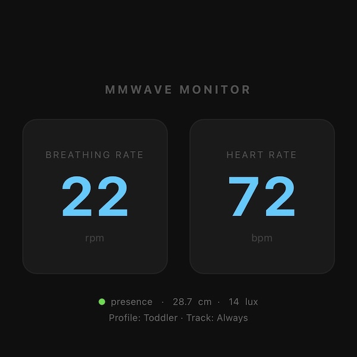

# mmWave Monitor

Arduino library and ESP32 application for the Seeed MR60BHA2 60 GHz mmWave sensor.

- Author: Lennart Hennigs (<https://www.lennarthennigs.de>)
- Copyright (C) 2026 Lennart Hennigs.
- Released under the MIT license.

## Description

`mmWaveKit` is an Arduino library that wraps the MR60BHA2 sensor with a Button2-style callback API for breathing rate, heart rate, and presence events. On top of it, this repo includes a complete ESP32 application with the following features:

- **Web dashboard** at `http://mmwave.local` — live breathing rate, heart rate, presence, lux, and distance via WebSocket
- **MQTT** with Home Assistant auto-discovery — 10 entities appear automatically on connect
- **Pushover notifications** for alert events with a direct link back to the dashboard
- **Three vital profiles:** `PROFILE_ADULT`, `PROFILE_CHILD` (3–12 yr), `PROFILE_TODDLER` (1–3 yr)
- **Light sensor gating** via `LIGHT_TRACK_MODE` — track only in dark, light, or always
- **OTA updates**, mDNS (`mmwave.local`), Telnet debug log, WiFiMulti with captive portal fallback

To see the latest changes please take a look at the [Changelog](CHANGELOG.md).

If you find this project helpful please consider giving it a ⭐️ at [GitHub](https://github.com/LennartHennigs/mmWave) and/or [buy me a ☕️](https://ko-fi.com/lennart0815).

## Hardware

The [MR60BHA2 mmWave Kit](https://wiki.seeedstudio.com/getting_started_with_mr60bha2_mmwave_kit/) combines a 60 GHz radar with a Seeed XIAO ESP32C6 for non-contact vital sign monitoring during sleep.

| Spec | Value |
| ---- | ----- |
| MCU | XIAO ESP32C6 (Wi-Fi + Bluetooth) |
| Sensor | 60 GHz mmWave radar |
| Breathing / heart rate range | up to 1.5 m |
| Presence detection range | up to 6 m |
| RGB LED | WS2812 addressable |
| Light sensor | BH1750 (1–65,535 lux) |
| Power | 5 V / 1 A |

> **Installation:** Mount ~1 m above the bed, tilted 45° downward toward the chest area. Designed for sleep monitoring — the manufacturer advises against use while seated at a desk or during exercise.

## Web Dashboard



`http://mmwave.local` — live breathing rate and heart rate, updated via WebSocket every second. Footer shows presence status, distance, and lux on the first line; active profile and tracking mode on the second line.

## Setup

1. Copy `src/config.example.h` → `src/config.h` and fill in your credentials
2. `pio run -t upload` (hold BOOT button, then connect USB)
3. Open `http://mmwave.local` in a browser

## WiFi

List every network to try in `config.h` — the device connects to the strongest available one:

```cpp
#define WIFI_NETWORKS \
  { "home-ssid",   "password" }, \
  { "backup-ssid", "password" },
```

On first boot (or if no configured network is reachable), the device starts a captive portal AP:

- **SSID:** `mmwave` · **Password:** set via `WIFI_AP_PASSWORD` in `config.h` · **Portal:** `http://192.168.4.1`

## OTA

Once running on WiFi, flash wirelessly:

```sh
pio run -e seeed_xiao_esp32c6_ota -t upload
```

Requires the device to be reachable at `mmwave.local`.

## Alerts

The firmware monitors breathing rate and heart rate against sleep-tuned thresholds and fires edge-triggered events. Two profiles are available (selected at compile time via `VITAL_PROFILE` in `config.h`):

| Profile           | Age      | Breathing rate | Heart rate  |
| ----------------- | -------- | -------------- | ----------- |
| `PROFILE_ADULT`   | 18+ yr   | 10–20 rpm      | 40–100 bpm  |
| `PROFILE_CHILD`   | 3–12 yr  | 16–30 rpm      | 60–120 bpm  |
| `PROFILE_TODDLER` | 1–3 yr   | 16–45 rpm      | 60–160 bpm  |

Alert events: `no_breathing`, `low_breathing`, `high_breathing`, `irregular_breathing`, `no_heart_rate`, `low_heart_rate`, `high_heart_rate`, `presence_on`, `presence_off`.

Thresholds are based on published reference ranges for sleeping vital signs:

- **Adult** — Quer et al. (2020): [Inter- and intraindividual variability in daily resting heart rate](https://journals.plos.org/plosone/article?id=10.1371/journal.pone.0227709), *PLoS ONE* — mean RHR 65 bpm, 95% range 50–82 bpm across 92,457 adults; bounds widened to 40–100 bpm to cover trained athletes and age-related variation during sleep
- **Toddler (1–3 yr)** — Fleming et al. (2011): [Normal ranges of heart rate and respiratory rate in children from birth to 18 years](https://pmc.ncbi.nlm.nih.gov/articles/PMC3789232/), *The Lancet* — RR median 26–36 rpm, HR median 100–113 bpm; bounds set wider to account for sleep-stage variation
- **Child (3–12 yr) / `PROFILE_CHILD`** — Fleming et al. (2011) (same): RR median 20–26 rpm, HR median 80–100 bpm

Notification gates in `config.h` let you silence individual categories:

```cpp
#define ALERT_NOTIFY_ONLINE       1   // "mmWave Online" + IP on boot
#define ALERT_NOTIFY_PRESENCE_ON  1   // presence detected
#define ALERT_NOTIFY_PRESENCE_OFF 1   // presence lost
#define ALERT_NOTIFY_BREATHING    1   // breathing alerts
#define ALERT_NOTIFY_HEART_RATE   1   // heart rate alerts
```

## Pushover

Set `ENABLE_PUSHOVER 1` and add your app token and user key to `config.h`. The device sends a notification on boot and on any active alert event. Critical alerts (vital signs) use Pushover priority 1 (bypasses quiet hours); presence and online notifications use priority 0. Every notification includes a link to `http://DEVICE_NAME.local` ("Open Dashboard") for one-tap access to the web UI.

## MQTT / Home Assistant

Set `ENABLE_MQTT 1` and configure the broker in `config.h`. Publishes HA MQTT auto-discovery on connect — 10 entities appear automatically:

- `sensor`: Breathing Rate, Heart Rate, Light Level
- `binary_sensor`: Presence, + 7 alert flags

State topic: `<MQTT_TOPIC_PREFIX>/sensor/state`  
Real-time alert topic: `<MQTT_TOPIC_PREFIX>/alert`

## Light Sensor

The onboard BH1750 lux sensor is read continuously. Use `LIGHT_TRACK_MODE` in `config.h` to gate data tracking:

- `LIGHT_TRACK_ALWAYS` — always active (default)
- `LIGHT_TRACK_DARK` — only track when lux is below the threshold
- `LIGHT_TRACK_LIGHT` — only track when lux is at or above the threshold

## Feature Flags

All major features can be disabled at compile time in `config.h`:

```cpp
#define ENABLE_WEBSERVER  1   // dashboard + WebSocket on port 80
#define ENABLE_MQTT       1   // MQTT + Home Assistant auto-discovery
#define ENABLE_PUSHOVER   1   // Pushover push notifications
#define ENABLE_OTA        1   // wireless OTA flashing
#define ENABLE_TELNET     1   // Telnet debug log on port 23
```

## Debug

`LOG()` output goes to both USB Serial (`DEBUG 1` in `config.h`) and any connected Telnet client (`ENABLE_TELNET 1`):

```sh
telnet mmwave.local
```

## License

MIT License

Copyright (c) 2026 Lennart Hennigs

Permission is hereby granted, free of charge, to any person obtaining a copy of this software and associated documentation files (the "Software"), to deal in the Software without restriction, including without limitation the rights to use, copy, modify, merge, publish, distribute, sublicense, and/or sell copies of the Software, and to permit persons to whom the Software is furnished to do so, subject to the following conditions:

The above copyright notice and this permission notice shall be included in all copies or substantial portions of the Software.

THE SOFTWARE IS PROVIDED "AS IS", WITHOUT WARRANTY OF ANY KIND, EXPRESS OR IMPLIED, INCLUDING BUT NOT LIMITED TO THE WARRANTIES OF MERCHANTABILITY, FITNESS FOR A PARTICULAR PURPOSE AND NONINFRINGEMENT. IN NO EVENT SHALL THE AUTHORS OR COPYRIGHT HOLDERS BE LIABLE FOR ANY CLAIM, DAMAGES OR OTHER LIABILITY, WHETHER IN AN ACTION OF CONTRACT, TORT OR OTHERWISE, ARISING FROM, OUT OF OR IN CONNECTION WITH THE SOFTWARE OR THE USE OR OTHER DEALINGS IN THE SOFTWARE.
